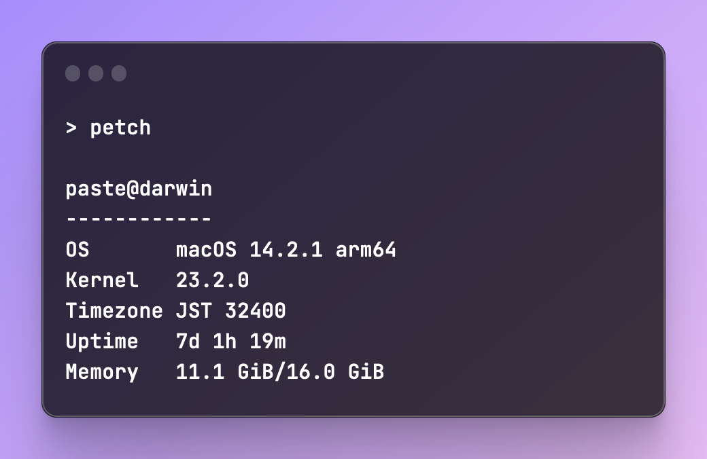

<h1 align="center"> Petch </h1> <br>
<p align="center">
    
</p>
<p align="center">
  A pretty system information tool written in Go.
</p>

<h2 align="center"> Installation </h2>

```console
go install github.com/pastc/petch@latest
```
